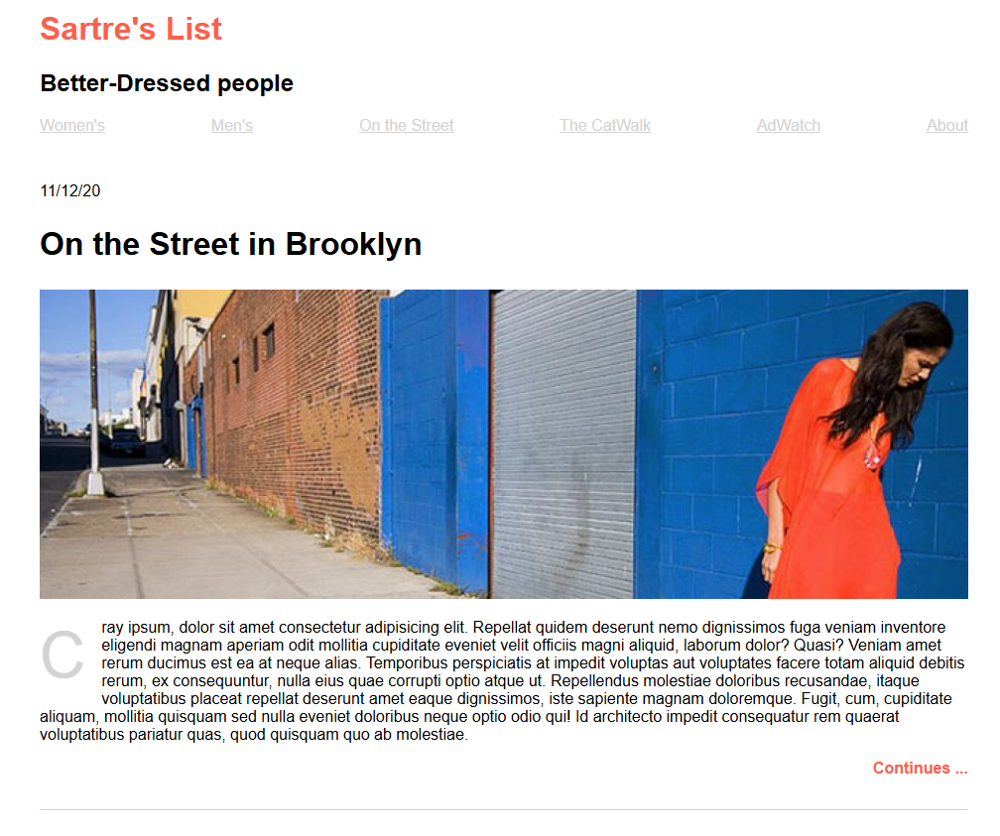

# Per Scholas ALAB 320H.1.2 - React Fashion Blog V1

(07/15 - 07/18)
Lab Assignment.

## Requirement:

The objective is to create a minimalistic fashion blog in HTML that renders two posts.

## About the Application:

It has a simple home page showcasing two sample posts.

## Preview:

## Links:

[REACT Vers.](https://github.com/RichardRiv/ALAB320H.1.2-React-Fashion-Blog-V2)

## Author

**[Richard](https://github.com/RichardRiv)**
